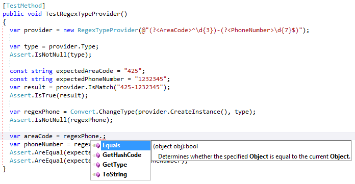
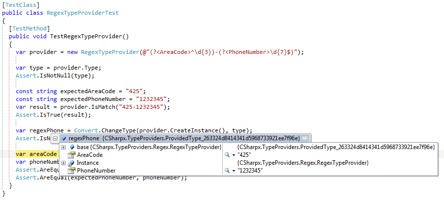

CSharpx
=======

CSharpx is a collection of libraries and tools for use with C#.

Excited by the F# TypeProviders i tried to also have TypeProviders in C#.

As an example i have written the Regex TypeProvider in C#.

Unfortunately the C# can not infer dynamically generated types like F# interactive does.
So the type information is not available at edit time.

The debugger instead can see the dynamically generated type and show the properties.

